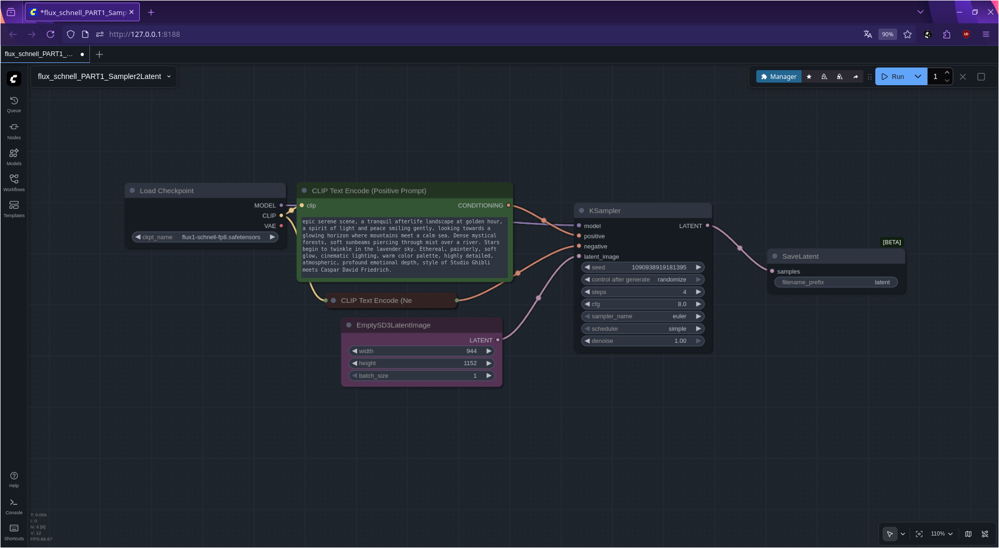
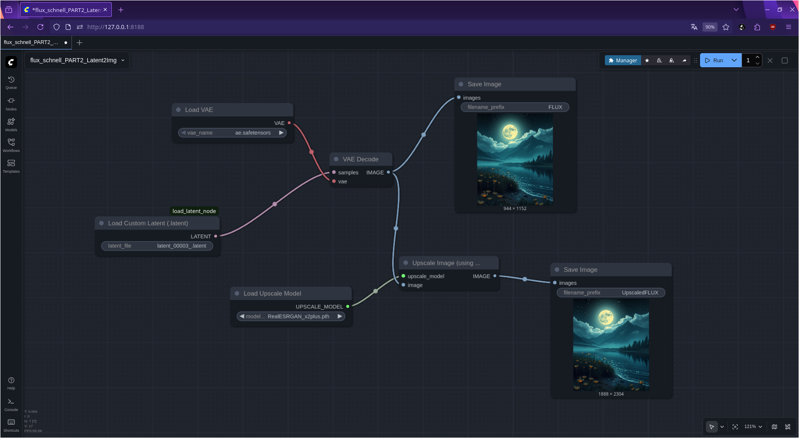

# LoadCustomLatent Node for ComfyUI

**LoadCustomLatent** is a custom node for [ComfyUI](https://github.com/comfyanonymous/ComfyUI) that enables **loading arbitrary `.latent` files directly from `ComfyUI/output`**, even if they were not generated within the current graph.

---

## Motivation

The standard **LoadLatent Node** in ComfyUI:

* Is primarily intended for **internal graph flow**, not for loading arbitrary latent files from disk.
* This makes it difficult to optimally use, for example, **high-resolution workflows** on 12 GB GPUs because the UNet and VAE remain loaded in VRAM.


This is particularly critical for AMD RDNA2 users with 12GB VRAM (e.g., RX 6700 XT), since ROCm lacks equivalent optimizations to NVIDIA's --xformers and model offloading capabilities. Without these tools, VRAM management becomes the primary bottleneck for FLUX workflows.


**Goal of this node:**

* Load `.latent` files directly, independently of SaveLatent nodes.
* Split the workflow: UNet can be unloaded after sampling → VRAM is freed.
* High-resolution (1024×1024) rendering becomes possible on smaller GPUs (e.g., 12 GB RDNA2).

---

## Installation

### Option 1: Simple Copy

1. Copy the node files into the ComfyUI `custom_nodes` directory:

```text
ComfyUI/
└── custom_nodes/
    └── load_latent_node/
        └── load_custom_latent.py
```

2. Restart ComfyUI.
3. The node will appear under `latent/io → LoadCustomLatent`.

### Option 2: GitHub Clone

1. Navigate to the `custom_nodes` directory:

```bash
cd /path/to/ComfyUI/custom_nodes
```

2. Clone the repository:

```bash
git clone https://github.com/sheepfreak221/LoadCustomLatent-Node-for-ComfyUI.git load_latent_node
```

3. Restart ComfyUI.

---

## Example Workflow: VRAM-Efficient Rendering

### The Problem

In ComfyUI, both UNet and VAE typically stay loaded in VRAM throughout the generation process, which limits the maximum resolution on GPUs with 12 GB or less VRAM.

### Two-Pass Workflow with LoadCustomLatent

#### **Pass 1: Sampling & Save** (High VRAM Usage)



**What happens:**

1. Load checkpoint (e.g., `flux1-schnell-fp8.safetensors`)
2. Configure sampler with your prompt
3. Generate latents
4. **Save latents to disk** using the `SaveLatent` node
5. **UNet is loaded in VRAM** during this phase

**VRAM Usage:** High
**Output:** `.latent` file saved to `ComfyUI/output/`

---

#### **Pass 2: Loading & Decoding** (Low VRAM Usage)



**What happens:**

1. Restart ComfyUI
2. **Load saved latents** using the `LoadCustomLatent` node
3. Connect to VAE decoder
4. Generate final image

**VRAM Usage:** Low (only VAE loaded)
**Output:** Final high-resolution image


> **Preview Option:** For quick testing, you can render a fast preview (~512×512) without splitting the workflow. Then use the two-pass workflow for high-resolution images (1024×1024 or higher) **using the same seed** to reproduce the preview exactly and avoid OOM on 12 GB GPUs.

---

### Workflow Comparison

|                            | Standard Workflow | Split Workflow with LoadCustomLatent |
| -------------------------- | ----------------- | ------------------------------------ |
| **VRAM Usage**             | UNet + VAE (high) | Only UNet or VAE                     |
| **Max Resolution on 12GB** | ~512×512          | **1024×1024+**                       |
| **Workflow**               | Single pass       | Two passes                           |

### When to Use This Pattern

1.    High-resolution rendering on limited VRAM (12GB or less)
2.    Batch processing: generate latents in bulk, decode later
3.    Model experimentation: try different VAEs on identical latents
4.    Latent archiving: save your best generations for future use
5.    Resource optimization: unload heavy models when not needed
6.    Team collaboration: share latents (small files) instead of full workflows

### Complete Workflow Files

* [Pass 1: Sampling](examples/workflows/flux_schnell_PART1_Sampler2Latent.json)
* [Pass 2: Decoding](examples/workflows/flux_schnell_PART2_Latent2Img.json)


---

## Required Models

This workflow example uses specific models that must be downloaded separately:

### 1. FLUX.1-schnell-fp8 Checkpoint
**Download:** [flux1-schnell-fp8.safetensors](https://huggingface.co/Comfy-Org/flux1-schnell/blob/main/flux1-schnell-fp8.safetensors)  
**Place in:** `ComfyUI/models/checkpoints/`

### 2. FLUX.1 VAE (ae.safetensors) - **Required!**
**Download:** [ae.safetensors](https://huggingface.co/frankjoshua/FLUX.1-dev/blob/main/ae.safetensors)  
**Place in:** `ComfyUI/models/vae/`

**Important Notes:**
- Both models are required for the example workflow to work
- The VAE is specifically needed for decoding the latents
- Total download size: ~17GB (checkpoint: ~16.1GB, VAE: ~0.3GB)
- Make sure to place them in the correct subfolders as shown above

---

## Advantages Over Stock LoadLatent

| Feature                           | Stock LoadLatent       | LoadCustomLatent       |
| --------------------------------- | ---------------------- | ---------------------- |
| Load arbitrary `.latent`          | Graph-internal only    | Directly from disk     |
| Subfolder support                 | No                     | Yes                    |
| Default / last selection          | No                     | Yes                    |
| Independent of UNet in VRAM       | No                     | Yes                    |
| Compatibility                     | ComfyUI internal       | External, no imports   |

---

## License

MIT License – free to use, modify, and distribute.